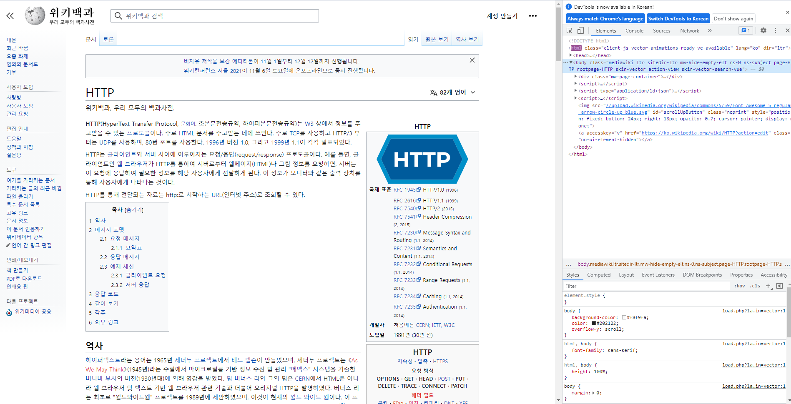
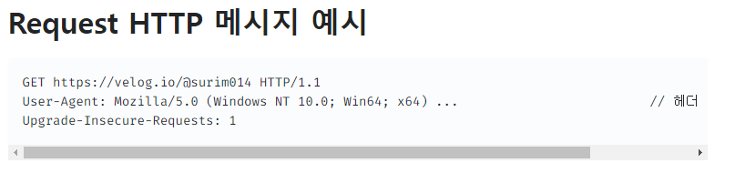

# Data Mining Study

## 11/2

### (1) HTTP 개요 

> 우리는 왜 data를 제공하는 서버로부터 데이터를 받아오려면 HTTP를 사용해야하는지 알아봅니다.

- HTTP(HyperText Transfer Protocol):
  - HyperText를 전송하는 **약속**
    - HyperText: HTML의 HT가 HyperText
  - 예전에는 HyperText만 전송하는 약속이었는데,
  - 이제는 HyperText말고 **거의 모든 데이터**를 HTTP로 전송하게 됨
    - 우리에게 익숙한 웹브라우저 URL도 결국 HTTP 방식으로 데이터를 받고 있다.
    - 우리가 다룰 데이터는 모두 HTTP로 전송 받아야됨
      - why? 내 컴퓨터에 저장되어 있는 경우가 거의 없다!
  - HTTP는 데이터 전송 Protocol계의 표준이야
    - 왜? 엄청나게 쉬워서.
    - 우리가 이용하기에도 엄청나게 간편
		- eg.) 엑셀을 사용할 때 VS 엑셀의 동작을 만들 떄
	

- 사실 웹 브라우저도 내부적으로는 아래와 같이 HTTP Request를 만들어서 데이터를 받아온다음,
사용자가 보기 쉽게 렌더링을 해서(꾸며서) 보여줌

- HTTP Data 주고 받기
  - 받기: HTTP **Request**
  - 주기: HTTP **Response**
  - 우리가 Request를 요청하면 Response로 요청한 데이터가 들어옵니다.

- 결론:
  - HTTP Request를 쉽게 만들어주는 프로그램 도구(Python)를 사용해서
  - HTTP Response로 데이터를 받아와 정제(refine)하자.
    - 정제는 다양한 방식으로 할 수 있다. (Pyhthon, 직접 손으로 이상한 문자열 노이즈 제거, 엑셀 function 활용)

### (2) API 개요

- **interface**: 
  - 사용자가 사용할 수 있는 기능들의 명세
    - e.g) 자동차의 interface:
        1. 엑셀을 밟으면 앞으로 나간다.
        2. 브레이크를 밞으면 멈춘다.
        3. 핸들을 오른쪽으로 꺾으면 회전한다.

- **GUI: Graphic User Interface**:
  - 그림으로 표현된 기능 명세:
    - e.g) 윈도우 화면, 인터넷 화면, 앱 화면
  - 인터페이스 중에서 99%를 차지함
    - 쉬우니까 그림이니까
  - **일반 사용자용**

- **CLI: Command Line interface**:
  - 명령어로 표현된 기능 명세:
    - e.g) 
      - DOS 프로그램
      - 윈도우 cmd 창에서 동작하는 명령어들
      - 리눅스 shell 창
  - 왜 CLI를 굳이 만들까?
    - GUI 하나 만드는데 비용이 크고, GUI 만드는 것보다 CLI 만드는게 싸서
    - 그래서 CLI로 GUI보다 보통 더 많은 기능을 사용할 수 있음
  - **헤비 사용자용**

> 여기까지는 독립된 하나의 프로그램  
> 하지만 개발자가 프로그램의 일부 기능만 사용하고 싶으면?  
> -> API를 사용해야함

----

- **API: Application Programming Interface**
  - 프로그램 함수(메소드)로 표현한 기능의 명세
  - 프로그램을 만들기 위한 기능 명세
  - 남이 만든 프로그램을 내 코드 안에서 쓰기 위해 사용하는 interface
    - e.g) 
      - 카카오 로그인 기능을 사용하기 위해 카카오의 로그인 API를 가져와서 사용
      - 카카오 OpenAPI를 사용해서 Daum에 저동으로 검색해주는 프로그램을 구현
      - MRI 분석하는 프로그램을 만들기 위해, AI 프로그램을 사용할 수 있는 API를 사용
  - **프로그래머용**
  

- 왜 API를 사용할 때 직접 소스코드나 프로그램 조각을 가져다 쓰지 못하고 HTTP를 사용해야하는가?
  - API를 제공하는 측의 소스코드를 보호하기 위해서 
    - e.g) 카카오나 네이버의 소스코드를 보호하기 위해서
  - 절대 소스코드에 직접 접근하도록 하는 경우는 없음
  - 대부분 API 이용은 HTTP 같은 원격 데이터 전송방식을 이용함.

- **OPEN API**:
  - 거대한 IT 회사나 공공기관에서 열어둔 API
    - 대부분 무료로 사용할 수 있음
    - e.g) 
      - https://developers.kakao.com/docs/latest/ko/daum-search/dev-guide
      - https://www.data.go.kr/index.do

### (3) Python으로 HTTP Request를 요청해보기

#### 1. HTTP Request를 만드는데 Python이 필요한 이유

- Python: (성능을 포기하고..) 사람의 말을 흉내내서 만들어놓은 프로그램 언어
  - java, c, kotlin 같은 언어는 python보다 상대적으로 어려움
  - Python이 제공하는 기능들이 되게 많고 편리함에 중점을 둔 언어
    - e.g) data 분석, http request 만들기, 문자열 다루기(e.g 트위터 글에서 오바마가 몇번 언급됐나)  

- HTTP Request: 
  - 간단하긴 하지만 직접 작성하기에는 너무 귀찮다.
  - Python의 도움을 받으면 3줄이면 되지만, 직접짜면 10줄이 넘어간다.
    - e.g) 신청서의 10줄을 채워야될 때 3줄만 채우고 7줄은 항상 똑같은 내용이라면 python이 7줄을 채워준다.

